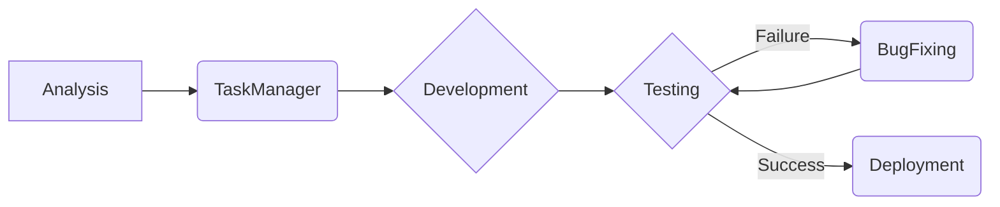
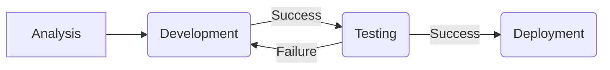
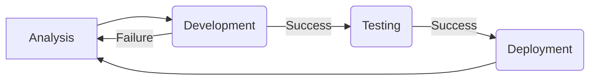
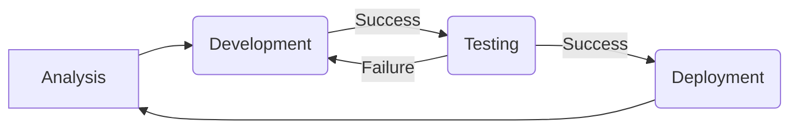

# 🤖 Vincius AI - AI-Powered Automation

Vincius AI is an intelligent system designed to transform your IT operations by harnessing the power of AI agents. By integrating Google's Gemini models, Vincius AI automates complex IT workflows, making your team more efficient, agile, and innovative. 

The name "Vincius" pays homage to Leonardo da Vinci, the quintessential Renaissance man whose relentless pursuit of knowledge and innovation across art, science, and engineering embodies the spirit of pushing boundaries and envisioning possibilities beyond the present. Just as da Vinci sought to revolutionize his world, Vincius AI aims to redefine the landscape of IT automation.

**Table of Contents**

*   [Why Choose Vincius AI?](#why-choose-vincius-ai)
*   [YAML-Defined Workflows](#1-yaml-defined-workflows)
    *   [Agent Configuration](#11-agent-configuration-model-selection-creativity-and-token-control)
*   [The Power of AI Agents](#2-the-power-of-ai-agents-your-intelligent-it-workforce)
    *   [AnalystAgent: The Master of Requirements](#-analystagent-the-master-of-requirements)
    *   [DeveloperAgent: The Limitless Architect of Code](#-developeragent-the-limitless-architect-of-code)
    *   [TaskManagerAgent: The Master of Task Breakdown](#-taskmanageragent-the-master-of-task-breakdown)
    *   [NotificationAgent: The Messenger of Progress](#-notificationagent-the-messenger-of-progress)
    *   [APIRequestAgent: The Integration Expert](#-apirequestagent-the-integration-expert)
    *   [DeployerAgent: The Deployment Guru](#-deployeragent-the-deployment-guru)
    *   [TestingAgent: The Guardian of Quality](#-testingagent-the-guardian-of-quality)
*   [Google Gemini Integration](#3-google-gemini-integration-the-ai-powerhouse)
*   [Real-World Automation](#4-real-world-automation-from-concept-to-deployment)
*   [Unleash Infinite Possibilities with Custom Workflows](#5-unleash-infinite-possibilities-with-custom-workflows)
*   [Getting Started](#-getting-started)
*   [Project Structure](#-project-structure)
*   [Configuration](#-configuration)
*   [License](#-license)
*   [Contributing](#-contributing)
*   [Ready to Transform Your IT Operations?](#-ready-to-transform-your-it-operations)

## ✨ Why Choose Vincius AI?

- **🚀 End-to-End Automation**: Automate every stage of your IT processes, from initial analysis to final deployment.
- **🧠 Intelligent AI Agents**: Each agent specializes in a specific IT function and executes tasks with minimal human intervention.
- **⚡️ Seamless Integration**: Easily integrates with your existing systems and tools, enhancing your current infrastructure.
- **📈 Unparalleled Efficiency**: Reduce manual effort, minimize errors, accelerate project delivery, and free up your team to focus on strategic initiatives.

## 🌟 Key Features

### 1. [YAML-Defined Workflows](#1-yaml-defined-workflows): The Blueprint for Automation

Vincius AI uses simple, human-readable YAML files to define IT workflows. This allows you to easily customize and adapt the system to your specific needs.

#### 1.1 [Agent Configuration](#11-agent-configuration-model-selection-creativity-and-token-control): Model Selection, Creativity, and Token Control

Each agent can be configured to use a different Google Gemini model, allowing you to optimize performance and cost. You can also adjust the agent's creativity with the `temperature` parameter and control token usage with the `max_tokens` parameter.

```yaml
workflow:
  Analysis:
    description: "Analyze and document the requirements for the software."
    responsible_department: ANALYSIS
    action:
      type: class_execution
      class: AnalystAgent
      module: Agents.Analyst.agent
      input_key: null
      output_key: analysis_result
      agent_config:
        model: "gemini-2.0-flash"  # Choose the Gemini model
        max_tokens: 1024           # Limit token usage
        temperature: 0.7           # Adjust creativity (0.0 - 1.0)
```

- `model`: Specifies the Google Gemini model to use (e.g., "gemini-2.0-flash", "gemini-2.0-pro").
- `max_tokens`: Limits the number of tokens the agent can use, helping to control costs.
- `temperature`: Adjusts the agent's creativity. Lower values (e.g., 0.2) produce more predictable results, while higher values (e.g., 0.9) produce more creative and varied results.

### 2. [The Power of AI Agents](#2-the-power-of-ai-agents-your-intelligent-it-workforce): Your Intelligent IT Workforce

Vincius AI comes with a suite of pre-built AI agents, each designed to excel in a specific IT function. These agents are not just scripts; they are intelligent entities that can understand, reason, and execute tasks with minimal supervision.

#### - [AnalystAgent](#-analystagent-the-master-of-requirements): The Master of Requirements

The AnalystAgent is the cornerstone of the Vincius AI system, responsible for transforming high-level project goals into actionable technical specifications. Here's how it works:

1.  **Requirement Gathering**: The agent ingests project requirements, user stories, and any existing documentation.
2.  **Technical Analysis**: Using Google's Gemini models, the agent analyzes these inputs to understand the project's scope, goals, and constraints.
3.  **Specification Generation**: The agent generates a comprehensive technical specification, including:

    *   **Overview**: A high-level description of the system.
    *   **Components**: Detailed descriptions of individual components, their purpose, functionality, requirements, technical considerations, and dependencies.
    *   **Technical Specifications**: In-depth details about the system architecture, recommended technologies, security considerations, performance requirements, and scalability considerations.
    *   **Implementation Details**: Step-by-step implementation guidelines, technical considerations, potential challenges, and best practices.
4.  **Documentation**: The agent generates markdown documents containing the technical analysis, ensuring that the development team has all the information they need to start building.

**Example**: The AnalystAgent can analyze user stories and acceptance criteria to produce a detailed software requirements specification (SRS) in under an minute, a task that typically takes a human analyst several days.

#### - [DeveloperAgent](#-developeragent-the-limitless-architect-of-code): The Limitless Architect of Code

The DeveloperAgent is the powerhouse of the Vincius AI system, capable of transforming technical specifications into virtually any software project imaginable. From crafting elegant Vue.js 3 websites to constructing intricate neural networks complete with training and evaluation pipelines, the DeveloperAgent has no limits. Here's how it works:

1.  **Code Generation**: The agent receives the technical specifications from the AnalystAgent and uses Google's Gemini models to generate high-quality, well-documented code. The DeveloperAgent doesn't just create code; it crafts entire projects, generating individual files with perfectly structured code and organizing them into directories that adhere to the conventions of the chosen framework.
2.  **Structure Verification**: The agent verifies the project structure, ensuring that all necessary files and components are present and correctly organized.
3.  **Code Review**: The agent reviews the generated code, identifying potential issues and suggesting improvements to ensure code quality and maintainability.
4.  **Refactoring**: If the code is too complex or doesn't meet quality standards, the agent refactors it into smaller, more manageable components.
5.  **Testing**: The agent works with the TesterAgent to create and execute tests, ensuring that the code meets the specified requirements and functions correctly.
6.  **Documentation**: The agent generates documentation for the code, making it easier for other developers to understand and maintain.

**Example**: Whether it's building a RESTful API, designing a complex machine learning model, or creating a user-friendly web application, the DeveloperAgent can handle it all. It can take a technical specification and generate a complete, well-documented project in a fraction of the time it would take a human developer.

#### - [TaskManagerAgent](#-taskmanageragent-the-master-of-task-breakdown): The Master of Task Breakdown

The TaskManagerAgent is the project management expert within Vincius AI, responsible for taking the technical specifications generated by the AnalystAgent and breaking them down into smaller, actionable tasks. Here's how it works:

1.  **Requirement Analysis**: The agent receives the technical specifications from the AnalystAgent.
2.  **Task Identification**: Using Google's Gemini models, the agent identifies all the individual tasks that need to be completed in order to implement the project.
3.  **Task Prioritization**: The agent prioritizes the tasks based on their importance and dependencies.
4.  **Resource Allocation**: The agent allocates resources to each task, ensuring that the right people are working on the right things.
5.  **Task Assignment**: The agent generates a CSV file containing all the tasks, which can be easily imported into your project management software of choice. We recommend [GitScrum](https://www.gitscrum.com/en/), a powerful and flexible project management tool.
6.  **Clear Communication**: The agent ensures that the tasks are clearly communicated to the DeveloperAgent, providing all the information needed to start coding.

**Example**: The TaskManagerAgent can take a complex technical specification and generate a detailed project plan with task dependencies, timelines, and resource assignments in a matter of minutes, reducing project planning time by up to 70%. The resulting CSV file can then be imported into GitScrum or another project management tool to track progress and manage resources.

#### - [NotificationAgent](#-notificationagent-the-messenger-of-progress): The Messenger of Progress

The NotificationAgent is the communication hub within Vincius AI, responsible for keeping all stakeholders informed about the progress of the project. Here's how it works:

1.  **Data Gathering**: The agent receives data about the current state of the project, including task status, test results, and deployment information.
2.  **Message Generation**: Using Google's Gemini models, the agent generates clear and concise notification messages tailored to each channel.
3.  **Channel Distribution**: The agent distributes the notifications to the appropriate channels, ensuring that everyone is kept in the loop.

**Currently Supported Channels**:

*   **Email**: Sends notifications via email, allowing for rich HTML formatting and detailed information.
*   **Slack**: Sends notifications to Slack channels, enabling real-time collaboration and quick updates.
*   **Microsoft Teams**: Sends notifications to Teams channels, ensuring that team members are always informed.
*   **WhatsApp**: Sends notifications via WhatsApp, providing instant updates to stakeholders on their mobile devices.

**Example**: The NotificationAgent can send automated status updates to project stakeholders via email, Slack, Teams, and WhatsApp, reducing the need for manual reporting and improving communication.

#### - [APIRequestAgent](#-apirequestagent-the-integration-expert): The Integration Expert

The APIRequestAgent creates and formats API requests, enabling seamless integration with other systems and tools. It ensures that Vincius AI can communicate with any platform.

**Example**: The APIRequestAgent can automatically generate API requests to provision cloud resources, configure network settings, and deploy applications, streamlining the infrastructure management process.

#### - [DeployerAgent](#-deployeragent-the-deployment-guru): The Deployment Guru

The DeployerAgent automates the software deployment process, ensuring minimal downtime and system stability. It guarantees that your software is always up and running.

**Example**: The DeployerAgent can automate the deployment of new software releases to production environments, reducing deployment time and minimizing the risk of errors.

#### - [TestingAgent](#-testingagent-the-guardian-of-quality): The Guardian of Quality

The TestingAgent is the quality assurance expert within Vincius AI, responsible for ensuring that the code meets the specified requirements and functions correctly. Here's how it works:

1.  **Test Analysis**: The agent analyzes the implementation files and technical documentation to understand the code's functionality and identify potential testing areas.
2.  **Test Generation**: Using Google's Gemini models, the agent generates high-quality test files for various testing types, including:

    *   **Unit Tests**: Tests individual components and functions in isolation.
    *   **Integration Tests**: Tests the interaction between different components and systems.
    *   **Regression Tests**: Ensures that existing functionality remains intact after code changes.
3.  **Test Execution**: The agent executes the generated tests and reports the results.
4.  **Bug Identification**: The agent identifies any bugs or issues found during testing and reports them to the development team.

**Example**: The TestingAgent can automatically generate a comprehensive suite of unit, integration, and regression tests for a complex software project, ensuring that the code meets the highest quality standards.

### 3. [Google Gemini Integration](#3-google-gemini-integration-the-ai-powerhouse): The AI Powerhouse

Vincius AI leverages the power of Google's Gemini models to provide intelligent automation capabilities. Gemini's advanced natural language processing and machine learning capabilities enable Vincius AI to understand, reason, and execute complex IT tasks with minimal human intervention.

**Note**: OpenAI integration is planned for a future release.

### 4. [Real-World Automation](#4-real-world-automation-from-concept-to-deployment): From Concept to Deployment

Vincius AI offers a highly customizable workflow, where every step can be tailored to your specific needs. The possibilities for the agents are virtually limitless, and everything is configured in a powerful YAML file.

Here's how Vincius AI automates a typical software development workflow:



1. **Analysis**: The AnalystAgent analyzes the project requirements and generates a detailed technical specification.
2. **Task Management**: The TaskManagerAgent breaks down the specification into actionable tasks and assigns priorities.
3. **Development**: The DeveloperAgent implements the code based on the tasks, following best practices and design patterns.
4. **Testing**: The TestingAgent creates and executes tests to ensure the software meets the requirements.
5. **Deployment**: The DeployerAgent automates the deployment process, ensuring minimal downtime and system stability.

### 5. [Unleash Infinite Possibilities with Custom Workflows](#5-unleash-infinite-possibilities-with-custom-workflows)

Vincius AI's true power lies in its ability to create an infinite number of custom workflows. By configuring the YAML file, you can define every step of your IT processes and tailor them to your specific needs.

**Workflow Cycles and Feedback Loops:**

The `next_steps` configuration allows you to create cycles and feedback loops in your workflow. This allows the system to handle different outcomes and loop back to previous steps for correction or refinement.

```yaml
workflow:
  Analysis:
    description: "Analyze and document the requirements for the software."
    responsible_department: ANALYSIS
    action:
      type: class_execution
      class: AnalystAgent
      module: Agents.Analyst.agent
      input_key: null
      output_key: analysis_result
      agent_config:
        model: "gemini-2.0-flash"
        max_tokens: 1024
        temperature: 0.7
    next_steps:
      success_step: Development

  Development:
    description: "Develop the software based on the analyzed requirements."
    responsible_department: DEVELOPMENT
    action:
      type: class_execution
      class: DeveloperAgent
      module: Agents.Developer.agent
      input_key: analysis_result
      output_key: development_output
      agent_config:
        model: "gemini-2.0-flash"
        max_tokens: 2048
        temperature: 0.9
      next_steps:
        success_step: Testing
        failure_step: Analysis  # Send back to Analyst if development fails

  Testing:
    description: "Test the developed software to ensure it meets the requirements."
    responsible_department: TESTING
    action:
      type: class_execution
      class: TesterAgent
      module: Agents.Testing.agent
      input_key: development_output
      output_key: testing_report
      agent_config:
        model: "gemini-2.0-flash"
        max_tokens: 512
        temperature: 0.8
        test_types: ["unit", "integration", "regression"]
    next_steps:
      failure_step: Development # Send back to Development if testing fails
      success_step: Deployment

  Deployment:
    description: "Deploy the final version of the software to production."
    responsible_department: OPERATIONS
    action:
      type: class_execution
      class: DeployerAgent
      module: Agents.Deployer.agent
      input_key: testing_report
      output_key: deployment_result
      agent_config:
        model: "gemini-2.0-flash"
        max_tokens: 2048
        temperature: 0.7
    next_steps:
      success_step: Analysis # Loop back to Analysis for new features or improvements
```

**Example Workflows:**

1.  **Feature Development with Bug Fixes:**



2.  **Iterative Analysis and Development:**



3.  **Continuous Improvement Cycle:**



The possibilities are endless! You can combine and customize these workflows to create a system that perfectly matches your IT operations.

## 🛠️ Getting Started

1. **Configuration**
```bash
# Set your Google API key in .env
GOOGLE_API_KEY: "your-api-key-here"
```

2. **Run the Workflow**
```bash
python main.py
```

## 📂 Project Structure
```
Vincius/
├── Workflows/           # Workflow definitions
│   ├── workflow.yaml   # Main workflow
│   └── Examples/       # Example workflows
├── config.yaml         # Configuration file
├── main.py            # Main execution script
```

## ⚙️ Configuration

The `config.yaml` file allows you to configure various aspects of the system:

- **File Paths**: Define the paths to your code and documentation directories.
- **Model Settings**: Configure model parameters such as temperature and max tokens.
- **Timing**: Adjust the sleep time between API requests.

## 🔒 License

This project is licensed under the Apache License 2.0 - see the [LICENSE](LICENSE) file for details.

## 🤝 Contributing

We welcome contributions! Please check out our [issues page](https://github.com/renatomarinho/Vincius-AI/issues) or submit a pull request.

## 🚀 Ready to Transform Your IT Operations?
